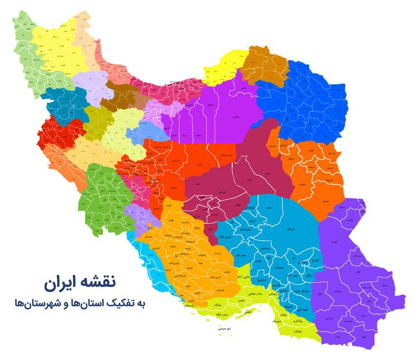

<div align="center">

[](#)

</div>

<p>


</p>

<div dir="rtl">

# لیست شهرها و استان های ایران

در این مخزن می‌توانید به لیست شهرها و استان های ایران با فرمت‌های گوناگون دسترسی پیدا کنید

## ویژگی ها

- لیست شهرهای ایران
- لیست شهرستان های ایران
- لیست شهرهای ایران با فرمت SQL
- لیست شهرستان های ایران با فرمت SQL
- لیست شهرهای ایران برای MySQL
- لیست شهرستان های ایران برای MySQL
- لیست شهرهای ایران برای postgres (PgSQL)
- لیست شهرستان های ایران برای postgres (PgSQL)
- لیست شهرهای ایران با فرمت JSON
- لیست شهرستان های ایران با فرمت JSON
- لیست شهرهای ایران با فرمت csv
- لیست شهرستان های ایران با فرمت csv
- لیست شهرهای ایران با فرمت xlsx
- لیست شهرستان های ایران با فرمت xlsx
- لیست شهرهای ایران با فرمت txt
- لیست شهرستان های ایران با فرمت txt

## نحوه استفاده

</div>
  
```shell
$ git clone https://github.com/sajaddp/list-of-cities-in-Iran.git
```

<div dir="rtl">

## مشارکت

از کمک شما برای تکمیل لیست و فرمت‌ها استقبال می‌کنم

### ویژگی های نیازمند مشارکت

- تابع نمونه Python &times;
- تابع نمونه ES6 &times;

</div>
  
---

# List of cities in Iran

In this repository, you can access the list of cities and provinces of Iran in various formats

## Features

- List of cities in Iran
- List of provinces in Iran
- List of cities in Iran with SQL format
- List of provinces in Iran with SQL format
- List of cities in Iran for MySQL format
- List of provinces in Iran for MySQL format
- List of cities in Iran for postgres (Pgsql) format
- List of provinces in Iran for postgres (Pgsql) format
- List of cities in Iran with JSON format
- List of provinces in Iran with JSON format
- List of cities in Iran with csv format
- List of provinces in Iran with csv format
- List of cities in Iran with xlsx format
- List of provinces in Iran with xlsx format
- List of cities in Iran with txt format
- List of provinces in Iran with txt format

## Usage

```shell
$ git clone https://github.com/sajaddp/list-of-cities-in-Iran.git
```

## Contributing

Pull requests are welcome. For major changes, please open an issue first to discuss what you would like to change.
